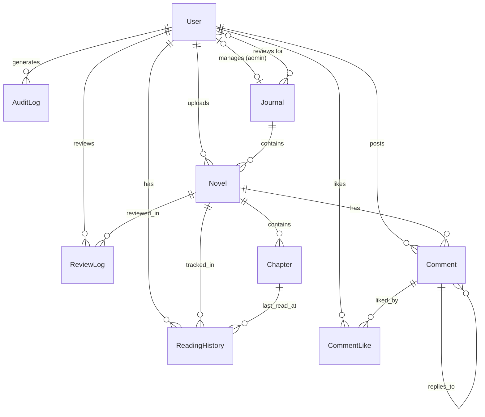

# 数据库设计

## 概述
数据库通过 **Prisma ORM** 进行管理。Schema 定义在 `prisma/schema.prisma` 中。我们目前使用 SQLite 以便由开发和移植，但它完全兼容 PostgreSQL。

## 数据生命周期与流向

### 1. 论文/稿件发布生命周期
`Novel` (在代码中保留原名，业务含义涵盖论文、小说等) 和 `Chapter` 的状态流转遵循严格的流程：
1.  **DRAFT (草稿)**: 作者创建内容。
2.  **AI_REVIEW (AI 预审)**: 提交后，内容被发送至 `ai-pre-review` 模块。
    *   如果 `pass: true`: 状态 -> `PENDING` (待人工审核)。
    *   如果 `pass: false`: 状态 -> `REJECTED` (自动驳回)。
    *   **数据**: 原始 JSON 分析结果存储在 `Novel.aiReviewRaw` 和 `Novel.aiQuality` 字段中。
3.  **PENDING (待审核)**: 审稿人/管理员在 `/admin/audit` 界面进行审核。
4.  **PUBLISHED (已发布)**: 内容对读者可见。

### 2. 用户会话生命周期
*   **登录**: 用户通过认证。
*   **活跃**: `User.role` 被缓存在 JWT 中。
*   **撤销**: 当管理员封禁用户 (`status: BANNED`) 时，下次用户客户端刷新会话（通常在页面跳转时），`jwt` 回调会检测到变更并立即使会话失效。

## 实体关系图 (ERD)

核心关系围绕 `User` (用户), `Novel` (稿件/论文), `Journal` (期刊) 和 `Comment` (评论) 实体展开。

## 数据模型

### 1. User (用户)
代表所有系统用户（读者、作者、审稿人、管理员）。
- **关键字段**: `email`, `password` (哈希后), `role` (USER, AUTHOR, REVIEWER, ADMIN, SUPER_ADMIN), `status` (ACTIVE, BANNED).
- **期刊权限**:
    - `managedJournal`: 关联作为管理员管理的期刊。
    - `reviewerJournals`: 关联作为审稿人的期刊列表。
- **角色**:
    - `USER`: 阅读论文，发表评论，管理个人资料。
    - `AUTHOR`: 提交论文，发布章节。
    - `REVIEWER`: 审阅稿件，提供反馈。
    - `ADMIN`: 审核内容，管理用户。
    - `SUPER_ADMIN`: 系统完全访问权限。

### 2. Journal (期刊)
代表学术期刊或文集容器。
- **关键字段**: `name`, `description`, `coverUrl`, `status` (ACTIVE, ARCHIVED).
- **关系**: 包含多篇 `Novel` (Paper)，拥有管理员 (`admins`) 和审稿人 (`reviewers`)。

### 3. Novel (稿件/论文)
代表一篇论文、小说或文章实体。
- **类型**: `type` (NOVEL, PAPER, AUTOBIOGRAPHY, ARTICLE)。
- **关键字段**: `title`, `description`, `coverUrl`, `status` (DRAFT, PUBLISHED 等)。
- **热度字段**: `popularity` (Float, 动态计算的热度值), `views` (浏览次数)。
- **PDF 支持**: `pdfUrl` (全文 PDF 链接), `pdfHash` (文件哈希用于去重)。
- **AI 字段**: `aiReviewPassed`, `aiQuality`, `aiReviewRaw` (存储来自 AI 预审的 JSON 分析结果)。
- **审计字段**: `lastSubmittedAt`, `lastApprovedAt`, `uploaderIp` (记录上传者 IP)。
- **归属**: `journalId` (所属期刊)。

### 4. Comment (评论)
支持多级回复的评论系统。
- **关键字段**: `content` (评论内容), `createdAt`。
- **匿名支持**: `guestName` (匿名用户名), `guestIp` (匿名用户 IP)。
- **关系**: 
    - `novel`: 所属论文。
    - `user`: 评论者（可选，未登录则为空）。
    - `parent`: 父评论（支持回复嵌套）。
    - `likes`: 关联 `CommentLike` 表。

### 5. CommentLike (点赞)
记录评论的点赞状态。
- **关键字段**: `userId` (登录用户), `guestIp` (未登录用户 IP)。
- **约束**: 复合唯一索引 `[userId, commentId]` 和 `[guestIp, commentId]` 防止重复点赞。

### 6. Chapter (章节)
代表论文中的具体章节或部分（主要用于非 PDF 类型的长篇内容）。
- **关键字段**: `title`, `content` (HTML/文本), `order` (序号)。
- **状态**: 章节拥有独立的生命周期 (`DRAFT` -> `PENDING` -> `PUBLISHED`)。
- **VIP 系统**: `isVip` (布尔值) - 决定章节是否需要订阅/付费（模拟）。

### 7. ReadingHistory (阅读历史)
追踪用户阅读进度。
- **复合键**: `[userId, novelId]` 确保每个用户每篇论文只有一条记录。
- **关联**: 链接到具体的 `Chapter` 以记忆确切位置。

### 8. ReviewLog (审核日志)
记录人工或 AI 审核的历史。
- **字段**: `reviewerId`, `action` (APPROVE/REJECT), `feedback`。
- **用途**: 责任追踪与作者反馈。

### 9. AuditLog (审计日志)
全系统的安全日志。
- **字段**: `action`, `resource`, `ipAddress`, `userId`。
- **用途**: 追踪关键操作（如封禁用户、删除论文）。
