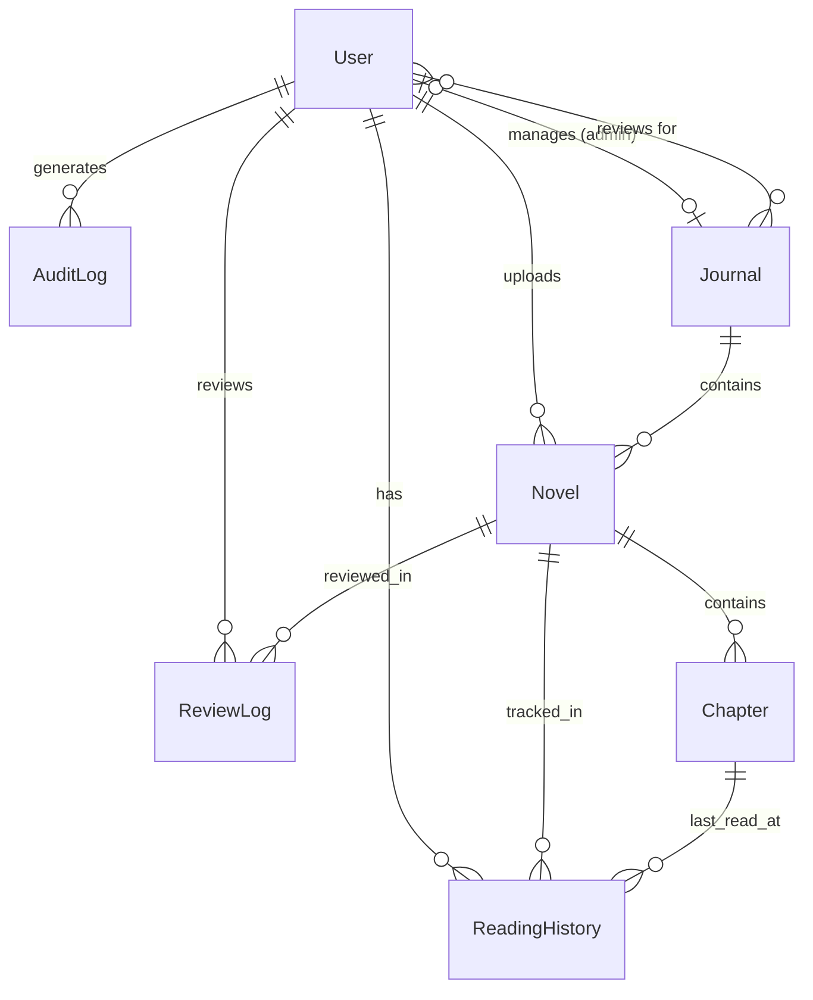

# Database Design

## Overview
The database is managed via **Prisma ORM**. The Schema is defined in `prisma/schema.prisma`. We currently use SQLite for development and portability, but it is fully compatible with PostgreSQL.

## Data Lifecycle & Flow

### 1. Paper/Manuscript Publishing Lifecycle
The state transition for `Novel` (retained name in code, business meaning covers papers, novels, etc.) and `Chapter` follows a strict process:
1.  **DRAFT**: Author creates content.
2.  **AI_REVIEW**: Upon submission, content is sent to the `ai-pre-review` module.
    *   If `pass: true`: Status -> `PENDING` (Awaiting manual review).
    *   If `pass: false`: Status -> `REJECTED` (Auto-rejected).
    *   **Data**: Raw JSON analysis results are stored in `Novel.aiReviewRaw` and `Novel.aiQuality` fields.
3.  **PENDING**: Reviewers/Admins review in the `/admin/audit` interface.
4.  **PUBLISHED**: Content becomes visible to readers.

### 2. User Session Lifecycle
*   **Login**: User authenticates.
*   **Active**: `User.role` is cached in JWT.
*   **Revocation**: When an admin bans a user (`status: BANNED`), the next time the user client refreshes the session (usually on page navigation), the `jwt` callback detects the change and invalidates the session immediately.

## Entity Relationship Diagram (ERD)

Core relationships revolve around `User`, `Novel` (Manuscript/Paper), and `Journal` entities.

## Data Models

### 1. User
Represents all system users (Readers, Authors, Reviewers, Admins).
- **Key Fields**: `email`, `password` (hashed), `role` (USER, AUTHOR, REVIEWER, ADMIN, SUPER_ADMIN), `status` (ACTIVE, BANNED).
- **Journal Permissions**:
    - `managedJournal`: Associated journal managed as an admin.
    - `reviewerJournals`: List of journals associated as a reviewer.
- **Roles**:
    - `USER`: Read papers, manage profile.
    - `AUTHOR`: Submit papers, publish chapters.
    - `REVIEWER`: Review manuscripts, provide feedback.
    - `ADMIN`: Audit content, manage users.
    - `SUPER_ADMIN`: Full system access.

### 2. Journal
Represents an academic journal or collection container.
- **Key Fields**: `name`, `description`, `coverUrl`, `status` (ACTIVE, ARCHIVED).
- **Relations**: Contains multiple `Novel` (Papers), has admins (`admins`) and reviewers (`reviewers`).

### 3. Novel (Manuscript/Paper)
Represents a paper, novel, or article entity.
- **Type**: `type` (NOVEL, PAPER, AUTOBIOGRAPHY, ARTICLE).
- **Key Fields**: `title`, `description`, `coverUrl`, `status` (DRAFT, PUBLISHED, etc.).
- **PDF Support**: `pdfUrl` (Full text PDF link), `pdfHash` (File hash for deduplication).
- **AI Fields**: `aiReviewPassed`, `aiQuality`, `aiReviewRaw` (Stores JSON analysis results from AI pre-review).
- **Audit Fields**: `lastSubmittedAt`, `lastApprovedAt`, `uploaderIp` (Records uploader IP).
- **Ownership**: `journalId` (Belonging journal).

### 4. Chapter
Represents a specific chapter or section within a paper.
- **Key Fields**: `title`, `content` (HTML/Text), `order` (Sequence).
- **Status**: Chapters have independent lifecycles (`DRAFT` -> `PENDING` -> `PUBLISHED`).
- **VIP System**: `isVip` (Boolean) - Determines if the chapter requires subscription/payment (simulated).

### 5. ReadingHistory
Tracks user reading progress.
- **Composite Key**: `[userId, novelId]` ensures only one record per user per paper.
- **Relation**: Links to a specific `Chapter` to remember the exact position.

### 6. ReviewLog
Records history of manual or AI reviews.
- **Fields**: `reviewerId`, `action` (APPROVE/REJECT), `feedback`.
- **Usage**: Responsibility tracking and author feedback.

### 7. AuditLog
System-wide security log.
- **Fields**: `action`, `resource`, `ipAddress`, `userId`.
- **Usage**: Tracks critical operations (e.g., banning users, deleting papers).
